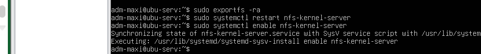

## Linux Server — File Sharing & Log Analysis
### Objective
Deploy an NFS share, harden SSH access, and automate detection of failed login attempts.

### User Administration
Created user: sys-adm

Assigned sudo privileges: sudo usermod -aG sudo sys-adm

This allows administrative actions without direct root usage.

### NFS Server Configuration
Created shared directory: /srv/linuxnfs

Added a test file and configured ownership: 
sudo chown nobody:nogroup /srv/linuxnfs
sudo chmod 777 /srv/linuxnfs

(Note: permissive permissions were used for lab accessibility — production environments should be more restrictive.)

### Export Configuration
Edited: /etc/exports

Added: /srv/linuxnfs 192.168.0.0/24(rw,sync,no_subtree_check)

Applied changes: 
sudo exportfs -ra
sudo systemctl enable nfs-kernel-server

### SSH Hardening
Edited: /etc/ssh/sshd_config

Changes:
- Modified default port
- Disabled root login

Restarted service: sudo systemctl restart ssh
These steps reduce automated attack exposure.

### Log Analysis Script
Created Bash script to detect failed login attempts.

Made executable: chmod +x ~/script2.sh

Validated logs via: tail -n 30 /var/log/auth.log

### Cron Automation

Added cron job: 0 * * * * /home/sys-adm/script2.sh >> /var/log/script2_cron.log 2>&1

Result: hourly log analysis with persistent output logging.
