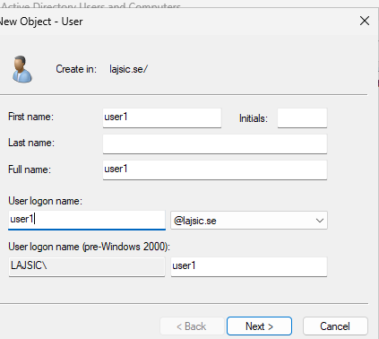
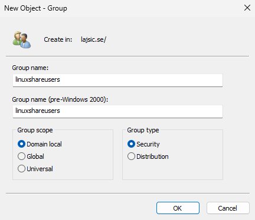
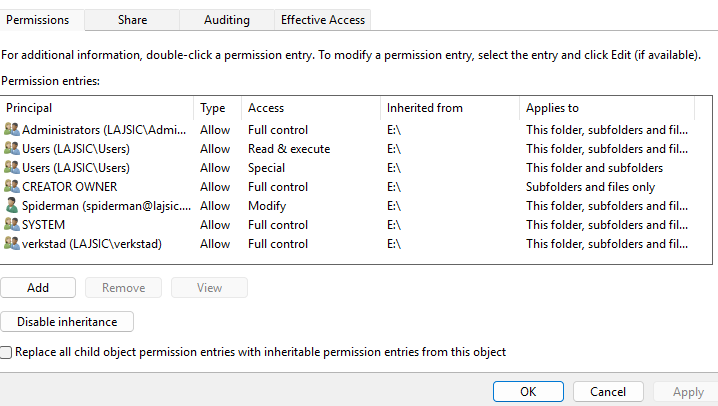
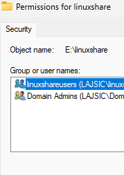
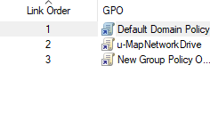
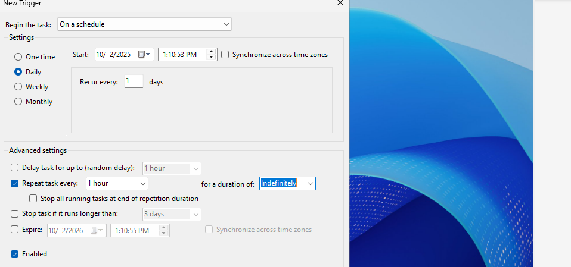

# Windows Server 2025 — File Server & Security

## Objective
Configure identity management, secure file sharing, password policies, and automated monitoring of failed login attempts.

## Active Directory — User & Group Creation
A domain user was created using Active Directory Users and Computers within the lajsic.se domain.

### Process:
- Created a new user with a defined logon name.
- Assigned a strong password.
- Disabled forced password change at next login to maintain password complexity.

### Security Group
A domain local security group named:

linuxshareusers 

was created to manage access to shared resources. 

### Why Domain Local?
Domain local groups are ideal for assigning permissions to resources within a specific domain.

The user was added to the group and membership was verified via group properties.

(Insert screenshot → images/windows/ad-user.png)

## Secure Shared Folder Configuration
A dedicated disk was used instead of the system drive to improve resilience in case of OS disk failure.

### Steps
Created folder:
linuxshare

- Enabled Advanced Sharing.
- Removed the default Everyone group.

Granted permissions only to:
- linuxshareusers
- Domain Admins

## NTFS Security
Inheritance was disabled to eliminate unintended permission propagation.

Permissions granted:

Modify → authorized groups only

### Security principle applied:
Least Privilege

(Insert screenshot → images/windows/share-permissions.png)

## Password Policy via Group Policy

A new Group Policy Object (GPO) was created and linked to the domain.

### Configurations:
- Minimum password length: 8 characters
- Account lockout threshold: 3 failed attempts

This reduces the effectiveness of brute-force attacks.

## PowerShell Monitoring Script
The provided script was modified to output failed login attempts to:
\\DC01\linuxshare\output.txt

The script was executed via PowerShell.

## Task Scheduler Automation
A scheduled task named:

FailedLoginMonitor

was created with the following behavior:
- Trigger: Daily
- Repeat: Every hour

Purpose: continuously monitor failed authentication attempts.

Testing confirmed that failed RDP logins generated log entries.

## Firewall Validation
Verified that the inbound firewall rule:
File and Printer Sharing (SMB-In)

was enabled to allow network access to shared folders.
